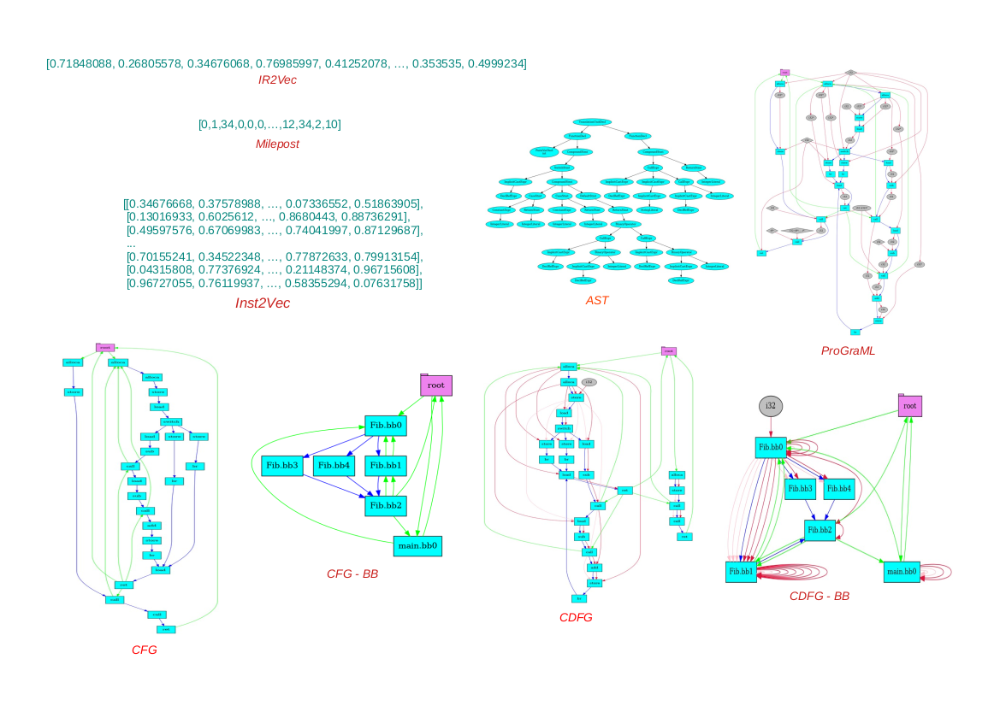

# Welcome to YaCoS

The growing popularity of machine learning frameworks and algorithms has greatly contributed to the design and exploration of good optimization sequences. Yet, in spite of this progress, mainstream compilers still provide users with only a handful of fixed optimization sequences. Finding optimization sequences that are good in general is challenging because the universe of possible sequences is potentially infinite. This repo describes YaCoS, an infrastructure that provides developers with the means to explore this space.


#### Table of Contents
- [Project Goals](#project-goals)
- [Building Blocks](#building-blocks)
- [Code Representations](#code-representations)
- [How to use YaCoS](#how-to-use-yacos)
- [Installation](#installation)
- [Datasets](#datasets)
- [Publication](#publication)
- [Contact](#contact)

# Project Goals

YaCoS consists of benchmarks, search algorithms, metrics to estimate the distance between programs, and compilation strategies. YaCoS's features let users build learning models that predict, for unknown programs, optimization sequences that are likely to yield good results for them.

- **The need for an infrastructure that jointly explores program representation, optimization sequences and learning models.** YaCoS is an infrastructure in which it is possible to investigate specific research questions, in the context of compilers and learning, as well as to jointly investigate various research questions.

- **Exploration of compiler optimization space.** Modern compiler provides several algorithms to transform the code in order to improve its performance. Such algorithms, known as optimizations, can be combined in different ways. This results in an infinite search space. Due to the intractability of the problem, search algorithms for good sequences of optimizations exploit a finite portion of the search space. YaCoS offers several algorithms that selectively explore the search space, with the objective of finding sequences of optimizations that are better than (or similar to) the standard sequences provided by the compiler.

- **Exploration of code representations.** Machine learning-based search algorithms employ different types of code representation. YaCoS has different types of representations, which vary from numerical vectors to more complex structures such as graphs.

- **The need to meet hardware requirements.** Software developed for different hardware platforms must meet the established requirements. An example of a requirement is the code size, which is essential for embedded platforms. YaCoS provides strategies for exploring sequences of optimizations that aim to achieve different requirements.

# Building Blocks

The building blocks provide search algorithms, functionalities for manipulating programs and objectives, and strategies to evaluate/extract program's features.

**1. Algorithms**

Algorithms provide several ways to create training data. The building blocks are:

- Benchmark reduction
- Create sequences
  - Genetic Algorithm
  - Particle Swarm Optimization
  - Random
- Find the best sequences
- Sequence manipulation
  - Batch Elimination
  - Iterative Elimination
  - Combined Elimination
  - Improved Batch Elimination
  - Reduction

**2. Data Processing**

Data Processing provides ways to analyze data. The building blocks are:

- Clustering

**3. Essentials**

Essentials provides ways to manipulate datasets and compiler optimization sequences. The building blocks are:

- Benchmark manipulation (compile, execute, ...)
- Objective/goal manipulation (single goal, multiple goals, ...)
- IO manipulation (load, dump, open, ...)
- Sequence manipulation (create, modification, ...)
- Dataset manipulation (download)
- Similarity (1D Euclidean distance, 2D Euclidean distance, edit distance, ...)

**4. Info**

Info provides different program representations. The building blocks are:

- 2D data representation
- Vectors representations
- Sequences representations
- Graphs representations

# Code Representations

<p align="center">

</p>

YaCoS has support for several code representations, some of which come from other researches.

- [ComPy-Learn: A Toolbox for Exploring Machine Learning Representations for Compilers.](https://doi.org/10.1109/FDL50818.2020.9232946) Alexander Brauckmann, Andrés Goens and Jeronimo Castrillon. Forum for Specification and Design Languages, 2020.
- [IR2Vec: LLVM IR Based Scalable Program Embeddings.](https://doi.org/10.1145/3418463) S. VenkataKeerthy, Rohit Aggarwal, Shalini Jain, Maunendra Sankar Desarkar, Ramakrishna Upadrasta and Y. N. Srikant. ACM Transactions on Architecture and Code Optimization, volume 17, number 4, 2020.
- [Neural Code Comprehension: A Learnable Representation of Code Semantics.](https://arxiv.org/abs/1806.07336) Tal Ben-Nun, Alice Shoshana Jakobovits and Torsten Hoefler. Advances in Neural Information Processing Systems 31. Curran Associates, 2018.
- [Practical Aggregation of Semantical Program Properties for Machine Learning based Optimization](https://doi.org/10.1145/1878921.1878951) Mircea Namolaru, Albert Cohen, Grigori Fursin, Ayal Zaks and Ari Freund. International conference on Compilers, architectures and synthesis for embedded systems, 2010.

# How to use YaCoS

 YaCoS provides several examples on how to extract representations, generate training data, create tasks, and others.

- **Extract Code Representation**
   - *AST graphs*
      - `./graph_from_ast.py <flags>`
      - `./graphs_from_ast.py <flags>`
   - *LLVM IR graphs*
      - `./graph_from_ir.py <flags>`
      - `./graphs_from_ir.py <flags>`
   - *Int2Vec*
      - `./inst2vec.py <flags>`
   - *IR2Vec*
     - `./ir2vec_from_ir.py <flags>`      
   - *Milepost Static Features*
      - `./milepost_from_ir.py <flags>`
   - *Sequence*
      - `./sequence.py <flags>`
- **Generate Training Data**
   - *Batch elimination*
      - `./batch_elimination.py <flags>`
   - *Iterative elimination*
      - `./batch_elimination.py <flags>`
   - *Combined elimination*
      - `./batch_elimination.py <flags>`
   - *Improved Batch elimination*
      - `./batch_elimination.py <flags>`
   - *Reduce benchmarks*
     - `./benchmark_reduction.py <flags>`
   - *Find the best k sequences from trained data*
     - `./best_k.py <flags>`
   - *Evaluate Partial sequences*
     - `./evaluate_partial_sequences.py <flags>`
   - *Evaluate k sequences*
     - `./evaluate_sequences.py <flags>`
   - *Extract the goal value for the compiler optimization levels*
     - `./levels.py <flags>`
   - *Generate and evaluate particle swarm optimization sequences*
     - `./pso.py`
   - *Generate and evaluate random sequences*
     - `./random_.py <flags>`
   - *Reduce sequences*
     - `./sequence_reduction.py <flags>`
   - *Generate and evaluate genetic sequences*
     - `./sga.py <flags>`
- **Implement Predictive Compilation**
   - *Case-based reasoning strategy to find good sequences for a unseeen program*
     - `./cbr.py <flags>`
   - *Case-based reasoning strategy to find good sequences for a unseeen program (functions)*
     - `./cbr_function.py <flags>`
- **Tasks**
  - *Classify Applications*
    - `classifapp.py <flags>`
- **Others**
   - *Measure the distance between programs (Milepost representation)*
     - `./distance.py <flags>`
   - *Extract the cost of each function*
     - `./function_cost.py <flags>`
   - *Extract the name of the variables and functions*
     - `./globals.py <flags>`

# Installation

YaCoS is compatible with Python 3.8, and is tested on Ubuntu 20.04. Other Linux distros should work as well.

To install YaCoS, follow these two steps:


```
1. git clone https://github.com/ComputerSystemsLab/YaCoS.git
```

```
2. cd YaCoS
  ./install_deps.sh
  ./setup.py [test|build|install]
```

# Datasets

|  Dataset | Description | Download |
|:---      |:---         |   :---:  |
||||
|                    | <a href="http://cuda.dcc.ufmg.br/angha/about">*AnghaBench*</a> |  <a href="http://www.csl.uem.br/repository/data/AnghaBench.tar.xz"></a> |
|**Benchmark**          | <a href="http://vhosts.eecs.umich.edu/mibench/">*MiBench*</a> | <a href="http://www.csl.uem.br/repository/data/MiBench.tar.xz"></a> |
|                    | <a href="https://www.embench.org/">*Embench*</a> | <a href="http://www.csl.uem.br/repository/data/embench-iot.tar.xz"></a> |
||||
|| *Number of LLVM Instructions - 15K programs/10K sequences* |<a href="http://www.csl.uem.br/repository/data/llvm_instructions.15k_progs.10044_seqs.tar.xz"></a> |
|**Pre-trained data** | *Number of LLVM Instructions - 15K programs/1K sequences* | <a href="http://www.csl.uem.br/repository/data/llvm_instructions.15k_progs.1290_seqs.tar.xz"></a> |
|| *Number of LLVM Instructions - 1.5K programs/1K sequences* | <a href="http://www.csl.uem.br/repository/data/llvm_instructions.1500_progs.1290_seqs.tar.xz"></a> |
|| *Number of LLVM Instructions - 1.5K programs/6 sequences* | <a href="http://www.csl.uem.br/repository/data/llvm_instructions.levels.tar.xz"></a> |
||||


# Publication

André Felipe Zanella, Anderson Faustino da Silva and Fernando Magno Quintão. 2020. [YACOS: a Complete Infrastructure to the Design and Exploration of Code Optimization Sequences.](https://doi.org/10.1145/3427081.3427089) Proceedings of the 24th Brazilian Symposium on Programming Languages. Association for Computing Machinery, New York, NY, USA, 56–63.

# Contact

_Anderson Faustino da Silva_ (csl@uem.br)
